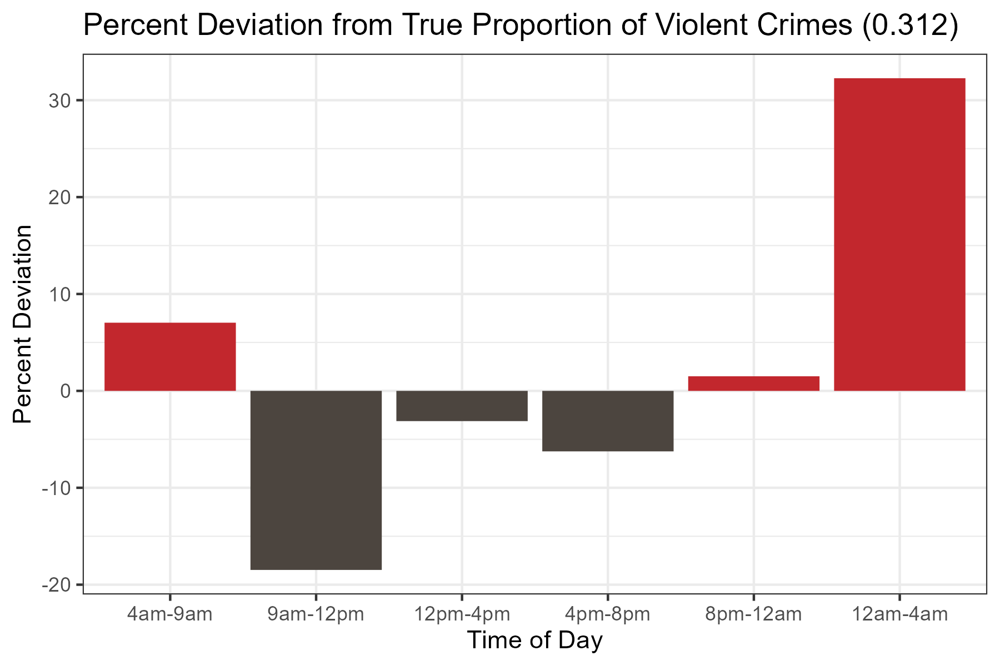
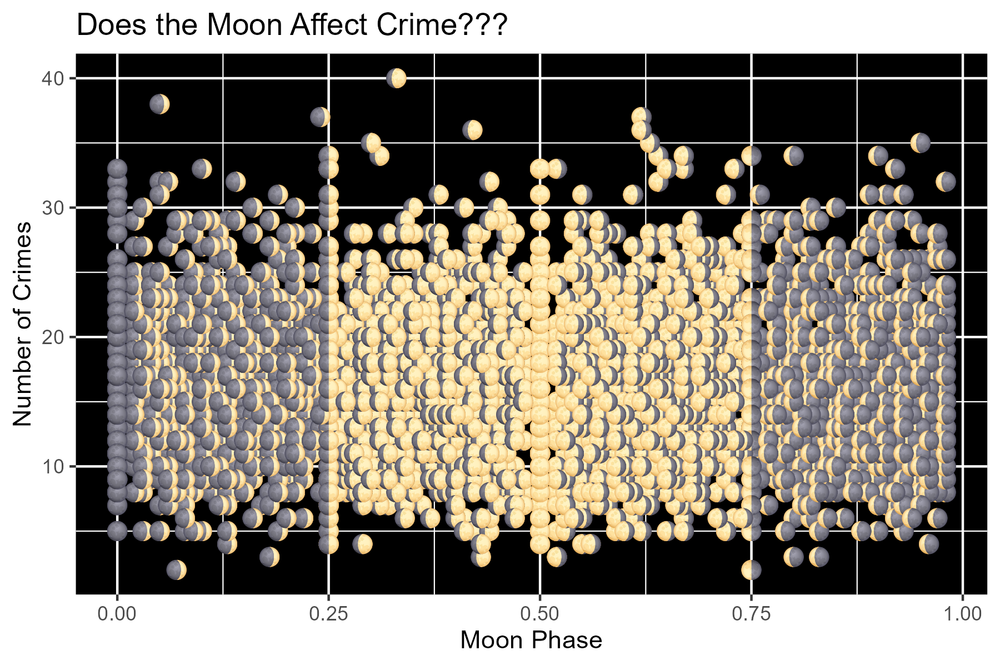

# Chicago Crime Analysis: A Case Study
A data-driven analysis of violent crime in Chicago's 11th District to identify key factors and provide actionable recommendations for the Chicago Police Department.

This project was a collaborative effort by Riley, Sydney, Spencer, and Hyeji for a statistics case study competition.

## Project Overview
The goal of this analysis was to move beyond simple crime mapping and uncover the underlying factors that influence violent crime. We aimed to answer critical questions for the Chicago PD:
* What are the most significant factors that affect violent crime rates? 
* Can we debunk common myths, such as the effect of a full moon on crime? 
* What actionable, data-driven recommendations can we provide to help the Chicago PD prevent violent crime?

We analyzed data from 2010 to the present, incorporating crime records, daily weather patterns, moon phases, and public holidays.

## Key Findings & Actionable Recommendations
Our analysis yielded several significant findings, which we translated into a 'What now?' action plan for the Chicago PD.

### Key Statistical Findings
* **Weather is a Major Factor:** We found a strong, statistically significant positive correlation between Max Average Temperature and the number of violent crimes. Crime rates show a clear seasonal pattern, peaking in the summer months
* **Economics Matter:** Annual Median Income was found to have a significant negative correlation with crime. This suggests that economic factors play a crucial role in crime rates.
* **Time is Predictive:** Using a Random Forest model and its feature importances, we determined that the Time of Day (specifically 'Late Night') is the single most important feature for predicting whether a crime is violent.
* **Debunking a Myth:** We investigated the long-standing belief that crime increases during a full moon. Our analysis showed it has a very low predictive importance (.052) and no clear, direct correlation was observed in our scatter plot.

### Actionable Recomendations
* **For Temperature:** Proactively increase officer presence on days forecasted to be warmer than average.
* **For Median Income:** Invest in workforce development programs and community resources, as this analysis suggests a link between economic health and public safety.
* **For Night vs. Day:** Improve street lighting in known hotspots and potentially re-evaluate bar closing times, as 'Late Night' is a key risk factor.
* **For Domestic Crime:** Spread awareness about resources like hotlines and violence centers, a key recommendation derived from our separate analysis of domestic vs. non-domestic crime factors.

## Methodology
We employed a multi-model approach to tackle the problem from different angles.

* Time Series Forecasting (R): We built a time series model to forecast the monthly volume of crimes. Our final model achieved a Root Mean Square Error (RMSE) of 40.209 when compared to fitted values , and an RMSE of 40.749 in our cross-validated forecast.
* Classification (Python): We used a Random Forest model to classify crimes as violent or non-violent, identifying 'Time of Day - Late Night' as the top predictor.
* Regression & Explainability (Python): We trained a Neural Network to predict the number of daily crimes. We then used SHAP (SHapley Additive exPlanations) with a Random Forest to create model-agnostic explanations, allowing us to understand why our model was making certain predictions (see shap_beeswarm.png).

**Tools Used:** Python (Pandas, Scikit-learn, SHAP), R (Tidyverse, forecast, ggplot2)

## File Descriptions:
### Data
- A file containing the all of the crimes from the Chicago Police Department district 11 since 2010
- A file containing the daily weather readings in Chicago since 2010
- A file containing major holidays
- A file containing Phases of the moon

### 4_Machine_Learning_Algorithms.ipynb
This is a python notebook containing 4 different machine learning models that we used to predict whether or not a crime was violent, It also contains a list of the feature importances that we got from the Random Forest

### \`Case Study Presentation.pdf\`
This file contains the presentation slides that we used when presenting our results

### Time_Series_Model.R
This file contains all of the code that we used to fit the time series models as well as validate our assumptions. It also contains code for generating many of the exploratory plots that we used.

### nn_shap.ipynb
This file contains the code used to fit and train our neural network as well as generate shap values for a random forest model. Both were used to predict number of daily crimes
## shap_beeswarm.png
A beeswarm plot of the SHAP values
